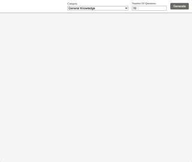

# FLASHCARDS APP

This application is a Flashcards App built with HTML, CSS and React that loads data from a trivia API and enables viewing of flashcards from different categories.

Users can select amount of cards to be shown. Each card has a question, options at the front and the correct answer at the back. The API used for this project is the [Open Trivia Database](https://opentdb.com).

## Features

- Loads data from the Open Trivia Database
- Loads empty view
- On user click, view opens with number of questions and categories chosen

## Technologies

- CSS
- HTML
- JavaScript
- React

## Start the App

### `npm start`

Runs the app in the development mode.\
Open [http://localhost:3000](http://localhost:3000) to view it in the browser.

The page will reload if you make edits.\
You will also see any lint errors in the console.

#### `npm test`

Launches the test runner in the interactive watch mode.\
See the section about [running tests](https://facebook.github.io/create-react-app/docs/running-tests) for more information.

#### `npm run build`

Builds the app for production to the `build` folder.\
It correctly bundles React in production mode and optimizes the build for the best performance.

The build is minified and the filenames include the hashes.\
Your app is ready to be deployed!

See the section about [deployment](https://facebook.github.io/create-react-app/docs/deployment) for more information.

##### Further Help

You can learn more in the [Create React App documentation](https://facebook.github.io/create-react-app/docs/getting-started).

### Author

[Tanimara Elias Santos](https://github.com/anthropovixen)

### Version

1.0.0
